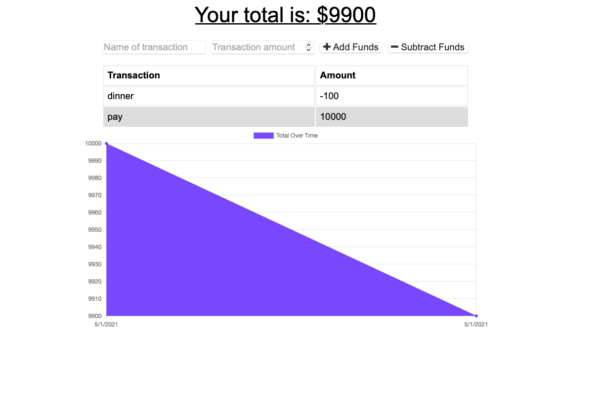

# budget-tracker

# usage
The user will be able to add expenses and deposits to their budget with or without a connection. When entering transactions offline, they should populate the total when brought back online.

# deployed link
https://legit-jb.github.io/budget-tracker/

# github repo
https://github.com/legit-jb/budget-tracker
